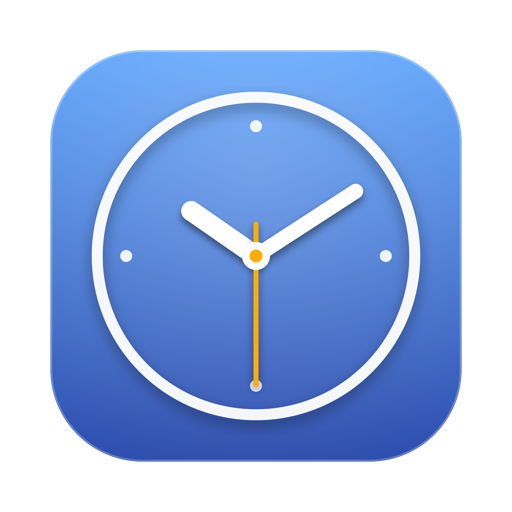
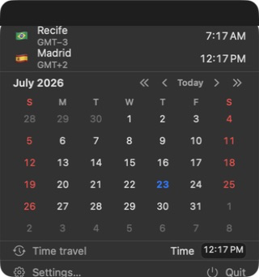

<div align="center">



# Meantime

**World clocks in your macOS menu bar.**

[](https://github.com/martonpaulo/meantime/actions/workflows/ci.yml)
[](https://github.com/martonpaulo/meantime/releases/latest)
[](#install)
[](LICENSE)




</div>

Your team is in New York. Your mom is in Recife. Your client is in Tokyo.
**Meantime keeps their clocks one glance away**: right in the menu bar.

## ⚡ Install

**[Download the latest DMG →](https://github.com/martonpaulo/meantime/releases/latest)**

Open it, drag Meantime onto Applications, launch. Done: it updates itself.

> Open source · direct download · macOS 26+

## ✨ What it does

| | |
|---|---|
| 🕐 **Clocks in the menu bar** | One item per clock, or every clock combined into a single item |
| 🎨 **Three styles per clock** | `09:47` · `🇺🇸 09:47` · a tiny analog face |
| 📅 **Quick calendar** | Click the menu bar → see the month. "The 15th is a… Tuesday." |
| 🔮 **Time travel** | Pick a day, type a time: every clock previews that moment |
| ⏰ **Scheduled clocks** | Show the NY clock only 8–12 and 13–17 Mon–Fri *NY time*; it hides itself outside those hours and days |
| ✏️ **Your format, your pattern** | Start with a common preset, write any Unicode pattern, or assemble one visually in the [interactive format builder](https://martonpaulo.com/meantime/format.html) |
| 🏷️ **Labels & leading items** | "Mom", "Tokyo Office": any name, with a country flag, custom emoji, custom text, or nothing before it |
| 🌐 **Every system time zone** | Place zones, UTC/GMT, and stable fixed-offset IANA identifiers |
| 🚀 **Open at login** | Set it once, forget it |

## 🔋 Fast and honest about energy

- The time comes **straight from the system clock**: never a private counter,
  never a delayed repaint. Updates land exactly on the minute (or hour) boundary.
- Meantime wakes **only as often as what you show changes**. Hour-only in the
  menu bar? It wakes ~once an hour. Nothing visible ticking? No timer at all.
- Sleep/wake, time-zone changes, clock changes → instant resync.

## 🔒 Simple by design

No accounts. No sync. No widgets. No telemetry. The only network request
Meantime ever makes is checking this repository for updates ([Sparkle](https://sparkle-project.org)).

## 🖼️ Settings

Native toolbar panes keep clock management, format presets, appearance,
startup, updates, and app information separate. New clocks remain drafts until
Add Clock; later edits stay inside Settings, preview live, and remain unsaved
until Save. Leaving a dirty editor always offers commit, discard, and cancel.

## 🛠 Build from source

```bash
make run    # build and run the debug app
make check  # build (warning-free) + tests + validation
make dmg    # the full installer DMG
```

`make` with no target lists everything. Docs: [architecture](docs/architecture.md) ·
[UI patterns](docs/ui-patterns.md) · [feature defaults](docs/feature-defaults.md) ·
[agent policy](AGENTS.md).

Website acceptance covers Chromium and WebKit/Safari. `make check` covers domain
and JavaScript behavior; browser layout, clipboard permissions, and assistive
technology still need the relevant real-browser or human checks.

## 📦 Releasing (maintainers)

Optional release environment names are documented in [.env.example](.env.example).
It contains examples only; build scripts do not automatically load an `.env` file.
Keep real signing identity and notary credentials in local environment/Keychain.

One-time: `make keys` (Sparkle key → Keychain) and a `notarytool`
credentials profile. Per release:

```bash
DEVELOPER_ID_IDENTITY="Developer ID Application: …" make dmg
NOTARY_PROFILE=<profile> make notarize DMG=artifacts/Meantime-x.y.z.dmg
make sign-update ZIP=artifacts/Meantime-x.y.z.zip
make appcast VERSION=x.y.z BUILD=<n> ZIP=… SIG='…'
git tag vx.y.z && git push --tags
```

Then upload the DMG + zip to the GitHub release. `make screenshots` refreshes
every image on this page from the real running app.

## 📄 License

[MIT](LICENSE) © 2026 Marton Paulo · Sparkle attribution in
[ATTRIBUTIONS.md](ATTRIBUTIONS.md)
