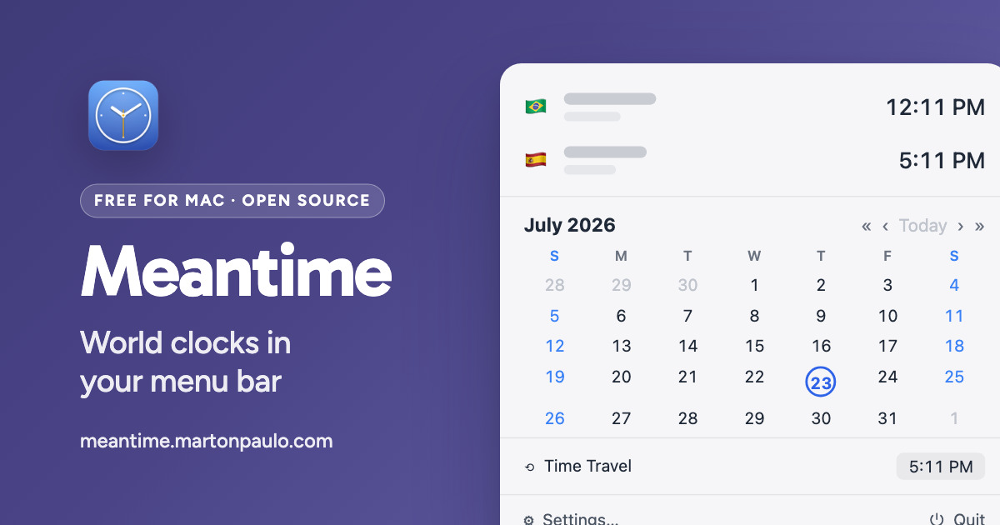

<div align="center">



# Meantime

World clocks in your macOS menu bar: scheduled clocks, quick calendar, time travel. Native, fast, private.

[](https://github.com/martonpaulo/meantime/actions/workflows/validate.yml) [](https://github.com/martonpaulo/meantime/actions/workflows/build.yml) [](https://swift.org) [](https://sparkle-project.org)

</div>

Your team is in New York. Your mom is in Recife. Your client is in Tokyo. **Meantime keeps their
clocks one glance away**, right in the menu bar: one item per clock or every clock combined, each in
the format you chose, each hidden outside the hours you actually care about it.

It is a **native macOS menu bar app with no account, no sync and no telemetry**. The time comes
straight from the system clock, the app wakes only as often as what you show changes, and the only
network request it ever makes is checking this repository for updates through
[Sparkle](https://sparkle-project.org).

---

<br />

## 🌱 Quick Start

Requires **macOS 26 or later** and the **Swift 6.2** toolchain.

```bash
git clone https://github.com/martonpaulo/meantime.git
cd meantime
make run    # build and run the debug app, unbundled
```

`make check` is the gate before any change lands: a warning-free build, the domain-kit tests, and
the repository invariants.

<br />

## 🛠 Commands

`make` with no target lists everything. The ones that matter:

| Command | What it does |
|---|---|
| `make build` | Build debug artifacts (must be warning-free) |
| `make test` | Run the `MeantimeKit` unit tests |
| `make run` | Run the debug app from the terminal (unbundled) |
| `make validate` | Check the repository invariants (`scripts/validate.sh`) |
| `make check` | `build` + `test` + `validate` |
| `make app` | Build the Release `.app` (ad-hoc unless `DEVELOPER_ID_IDENTITY` is set) |
| `make dmg` | Build the installer DMG |
| `make notarize` | Notarize and staple a signed DMG (`DMG=…`, `NOTARY_PROFILE`) |
| `make sign-update` | Print the Sparkle appcast signature for a release zip (`ZIP=…`) |
| `make appcast` | Update `appcast.xml` (`VERSION`, `BUILD`, `ZIP`, `SIG`) |
| `make keys` | Generate the Sparkle signing key into the Keychain |
| `make icon` · `make installer-assets` · `make web-assets` | Regenerate icon and installer art |
| `make regions` | Rebuild the time-zone → region table from the system tz database |
| `make social-card` | Render `docs/social-card.jpg` from `design/social-card/` |
| `make screenshots` | Refresh the screenshots in `docs/screenshots/` |
| `make clean` | Remove build artifacts |

<br />

## 🔐 Secrets and variables

**No GitHub Actions secret is configured, and no workflow reads one.** Validate, Build and Test, and
GitHub Pages all run on public inputs only. Releases are cut locally, so the signing material stays
on the release Mac: the Developer ID identity and the Sparkle private key live in the **Keychain**,
and the notary credentials live in a **`notarytool` credentials profile**. Nothing here is loaded
from a `.env` file; [.env.example](.env.example) documents names for your own shell, not values.

| Name | Where it is read | What it is |
|---|---|---|
| `DEVELOPER_ID_IDENTITY` | `make app`, `make dmg` | The Developer ID Application identity **label**. Unset means an ad-hoc signature |
| `NOTARY_PROFILE` | `make notarize` | The name of an existing `notarytool` Keychain profile |
| `APP_OUTPUT`, `ZIP_OUTPUT`, `DMG_OUTPUT`, `DMG_WORK_DIR` | packaging targets | Optional output paths; existing artifacts are never overwritten |
| `SWIFT` | development targets | Optional path to a different `swift` executable |

`VERSION`, `BUILD`, `ZIP`, `DMG` and `SIG` are explicit `make` arguments, not credentials.

---

<br />

## What it does

| | |
|---|---|
| 🕐 **Clocks in the menu bar** | One item per clock, or every clock combined into a single item |
| 🎨 **Three styles per clock** | `09:47` · `🇺🇸 09:47` · a tiny analog face |
| 📅 **Quick calendar** | Click the menu bar → see the month. "The 15th is a… Tuesday." |
| 🔮 **Time travel** | Pick a day, type a time: every clock previews that moment |
| ⏰ **Scheduled clocks** | Show the NY clock only 8–12 and 13–17 Mon–Fri *NY time*; it hides itself outside those hours and days |
| ✏️ **Your format, your pattern** | Start with a common preset, write any Unicode pattern, or assemble one visually in the format builder |
| 🏷️ **Labels & leading items** | "Mom", "Tokyo Office": any name, with a country flag, custom emoji, custom text, or nothing before it |
| 🌐 **Every system time zone** | Place zones, UTC/GMT, and stable fixed-offset IANA identifiers |
| 🚀 **Open at login** | Set it once, forget it. Settings shows the real system state, including a registration still waiting for your approval |

<br />

## Fast and honest about energy

- The time comes **straight from the system clock**: never a private counter, never a delayed
  repaint. Updates land exactly on the minute (or hour) boundary.
- Meantime wakes **only as often as what you show changes**. Hour-only in the menu bar? It wakes
  ~once an hour. Nothing visible ticking? No timer at all.
- Sleep/wake, time-zone changes, clock changes → instant resync.

<br />

## Settings

Native toolbar panes keep clock management, format presets, appearance, startup, updates, and app
information separate. New clocks remain drafts until Add Clock; later edits stay inside Settings,
preview live, and remain unsaved until Save. Leaving a dirty editor always offers commit, discard,
and cancel: switching panes, closing the window, and quitting the app all ask.

<br />

## How CI is split

CI is split by what each workflow can actually observe. **Validate** runs the repository invariants
and the format-builder tests for every change, and **Build and Test** runs the warning-free release
build and the suite only when Swift sources, the package manifest, or the packaged app resources
change.

Website acceptance covers Chromium and WebKit/Safari. `make check` covers domain and JavaScript
behavior; browser layout, clipboard permissions, and assistive technology still need the relevant
real-browser or human checks.

<br />

## Releasing (maintainers)

One-time: `make keys` (Sparkle key → Keychain) and a `notarytool` credentials profile. Per release:

```bash
DEVELOPER_ID_IDENTITY="Developer ID Application: …" make dmg
NOTARY_PROFILE=<profile> make notarize DMG=artifacts/Meantime-x.y.z.dmg
make sign-update ZIP=artifacts/Meantime-x.y.z.zip
make appcast VERSION=x.y.z BUILD=<n> ZIP=… SIG='…'
git tag vx.y.z && git push --tags
```

Then upload the DMG and the zip to the GitHub release.

`make screenshots` captures the real windows on screen with `screencapture -l<windowid>`, because
the window shadow, corner radius and material are drawn by the window server and an offscreen render
of the same view has none of them. It needs a Retina display and `cwebp`, and refuses to run without
them. The method, and the reason for each rule, is documented at the top of
[`scripts/capture-screenshots.sh`](scripts/capture-screenshots.sh).

Further reading: [architecture](docs/architecture.md) · [UI patterns](docs/ui-patterns.md) ·
[feature defaults](docs/feature-defaults.md) · [agent policy](AGENTS.md) ·
[contributing](CONTRIBUTING.md) · [security](SECURITY.md).

---

<br />

## Limitations

- **macOS 26 or later only.** There is no iOS, iPadOS or watchOS companion, and no older-macOS build.
- **No accounts, no sync, no widgets, no telemetry.** Clocks live on the Mac you created them on.
- **Time zones only.** Meantime does not schedule meetings, read calendars, or convert durations.
- Scheduled clocks follow the clock's **own** zone, so a schedule written for one zone does not
  translate itself when you change that zone.
- `make screenshots` is a maintainer tool: it needs a Retina display and `cwebp`, and refuses to run
  without them.

<br />

## License and attribution

[MIT](LICENSE) © 2026 Marton Paulo.

Sparkle attribution in [ATTRIBUTIONS.md](ATTRIBUTIONS.md).
